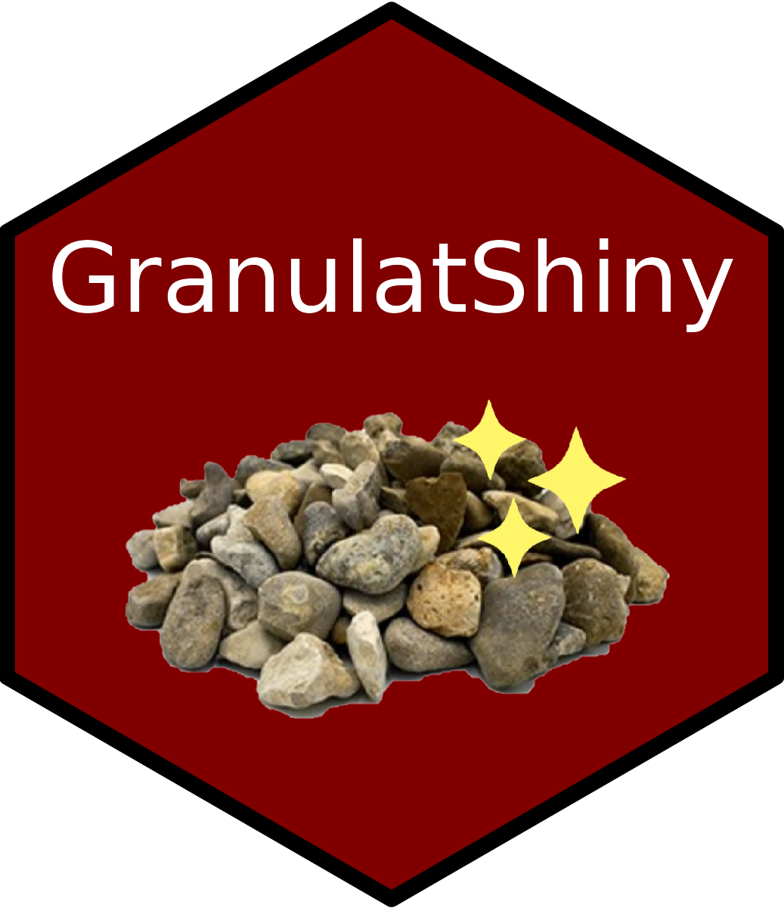

# Page d'accueil

Welcome to the user guide for your app! <br>
```{r, echo=FALSE,  out.width = "50%", fig.align = "left"}

```
<br>Avant de commencer, notez que vous rencontrerez différents boutons dans l'application.
<br>Les boutons sans icône vous permettent de passer d'un onglet à un autre.
```{r, echo=FALSE, warning=FALSE}
library(shiny)
actionButton("start", "start")
```

Ceux portant un petit dragon désignent une étape obligatoire.
```{r, echo=FALSE, warning=FALSE}
actionButton("go", "Mettre en forme",icon = icon("dragon"))
```
Les boutons avec une flèche permettent de télécharger des résultats de l'application. Les formats sont (csv, png, txt, rds).
```{r, echo=FALSE, warning=FALSE}
actionButton("tel", "Telecharger la table",icon = icon("download"))
```
Pour passer à la suite appuyer sur le bouton start de la page d'accueil.

## Mise en forme des données

### Informations à rentrer

La première étape de l'application est l'importation des données.<br> 
Si vous avez vos données, vous devez sélectionner les 2 premiers fichiers : TuttiCatch et TuttiOperation. Seul le format csv est pris en charge. Le tableau Capture concerne les données de capture provenant de l'échantillonnage des pêcheries et le tableau Opération correspond à toutes les informations dérivées des stations d'échantillonnage (type d'engin, durée des traits de chalut, coordonnées gps, etc.).<br>
Attention, si vous n'appliquez pas le bon fichier, un message d'avertissement apparaîtra sur l'interface.<br>
Si vous voyez ce message, je vous recommande d'ouvrir l'avis pour comparer le fichier attendu avec votre fichier.Après avoir appliqué le fichier TuttiOperation, une carte apparaîtra et vous aurez la possibilité d'interagir avec les cases Stations d'impact et Stations de référence.

Vous pouvez importer les fichiers de forme de la zone d'étude. Dans la case stations d'impact, vous pouvez vérifier et modifier la période d'étude. Vous devez également écrire dans l'espace correspondant les stations qui sont impactées par le site d'extraction. La couleur des différents prélèvements devient rouge pour la station impactée (un type de rouge par prélèvement) (figure ci-dessous). Dans la case stations de référence, vous pouvez indiquer s'il y a des stations à retirer de l'analyse.<br>
Si vous avez déjà sauvegardé le paramétrage dans un fichier, vous pouvez le télécharger et toutes les cases sont remplies automatiquement.<br>
Enfin, lorsque vous êtes prêt, vous pouvez appuyer sur le bouton pour passer à la partie suivante. Si vous n'appuyez pas sur le bouton, rien ne se passera et vous ne serez pas en mesure de poursuivre l'analyse. Si vous avez plus d'un site à analyser, vous pouvez revenir dans cet onglet et changer les fichiers puis appuyer à nouveau sur le bouton.<br>

Si vous n'avez pas de données vous pouvez l'indiquer et l'application chargera directement les données d'une concession factice.
Les étapes décrites avant se feront automatiquement.

### Table

Learn how to work with tables and format your data effectively.

## Statistiques exploratoires

### Plot des indicateurs

Explore different plots to understand key indicators.

### Plot de la structure

Visualize the structure of your data using various plotting techniques.

## Statistiques descriptives

### Plot des données

Generate descriptive plots to better understand your dataset.

### Diagnostique d'analyse

Perform diagnostic analysis on your data.

## Modélisation

### Création des modèles

Learn how to create models for your data.

### Représentation des effets

Visualize the effects of your models.

### Puissance statistique

Understand and analyze the statistical power of your models.
